<div align="center">

[![LinkedIn][linkedin-shield]][linkedin-url]

</div>

<!-- PROJECT LOGO -->
<br />
<p align="center">
  <a href="https://github.com/judsonjuniorr/marvelheroes">
    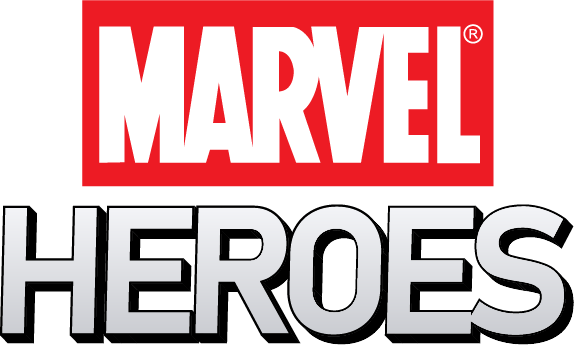
  </a>

  <h3 align="center">Marvel Heroes</h3>

  <p align="center">
    <br />
    <i>"A única maneira de saber o quão forte você é, é continuar testando seus limites."</i>
    <br >
    <small style="opacity: 0.7">Clark Kent / Kal-El (Superman)</small>
    <br />
    <br />
    <a href="https://marvelheroes.judsonjunior.com/"><strong>Visualizar demo</strong></a>
  </p>
</p>

<!-- TABLE OF CONTENTS -->
<details open="open">
  <summary><h2 style="display: inline-block">Guia de conteúdo</h2></summary>
  <ol>
    <li>
      <a href="#about-the-project">Sobre o projeto</a>
      <ul>
        <li><a href="#built-with">Criado com</a></li>
      </ul>
    </li>
    <li>
      <a href="#getting-started">Começando</a>
      <ul>
        <li><a href="#prerequisites">Pré-requisitos</a></li>
        <li><a href="#installation">Instalação</a></li>
      </ul>
    </li>
    <li>
      <a href="#usage">Uso</a>
      <ul>
        <li><a href="#use-home">Página inicial</a></li>
        <li><a href="#use-search">Pesquisa</a></li>
        <li><a href="#use-char">Perfil do personagem</a></li>
        <li><a href="#use-serie">Perfil da série</a></li>
      </ul>
    </li>
  </ol>
</details>

<!-- ABOUT THE PROJECT -->

## Sobre o projeto

<!-- Foto da aplicação -->

[![Marvel Heroes][product-screenshot]][demo-url]

Esse projeto tem como objetivo permitir ao usuário listar/buscar todos os personagens da marvel e realizar alterações no nome e descrição do mesmo.
Contamos com uma relação de todas as séries disponíveis para cada personagem, ao acessar a página de perfil da série é possível também visualizar todos os personagens que participaram dela.

### Feito com ❤ e

- [Create React App](https://create-react-app.dev/)
- [TypeScript](https://create-react-app.dev/docs/adding-typescript/)
- [Redux](https://redux.js.org/)

<!-- GETTING STARTED -->

## Começando

Para baixar uma cópia do projeto e ter ela rodando em sua máquina, siga o passo-a-passo abaixo

### Pré-requisitos

Aqui temos uma lista das aplicações que são necessárias para ter seu projeto rodando.

- [Chave de uso da API](https://developer.marvel.com/signup)
- [Node.JS](https://nodejs.org/en/)
- npm
  ```sh
    npm install npm -g
  ```

### Instalação

1. Clone o repositório
   ```sh
   git clone https://github.com/judsonjuniorr/marvel.git
   ```
2. Entre na pasta do projeto
   ```sh
   cd marvel
   ```
3. Instale os pacotes utilizados na aplicação
   ```sh
    npm install
   ```
4. Copie o conteúdo do arquivo .env.example para um novo arquivo nomeado .env e substitua o valor das 2 chaves de acesso com as geradas no processo anterior
   ```dosini
    REACT_APP_PUBLIC_KEY=sua-chave-publica
    REACT_APP_PRIVATE_KEY=sua-chave-privada
   ```
5. <strong>Dê inicio</strong> a uma experiência única
   ```sh
   npm run start
   ```

<!-- Exemplos de uso -->

## Uso

### <strong id="use-home">Página inicial</strong>

- No topo do conteúdo você encontrará uma box para que seja feito a pesquisa do nome do personagem, essa pesquisa é feita a partir do inicio do nome do personagem.

  Ex.: Para pesquisar Super-Man deverá colocar o inicio do nome, como Sup ou Super e apertar enter

    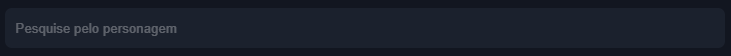

- Na pagina inicial irá carregar automaticamente 28 personagens possibilitando carregar mais atráves da navegação.

    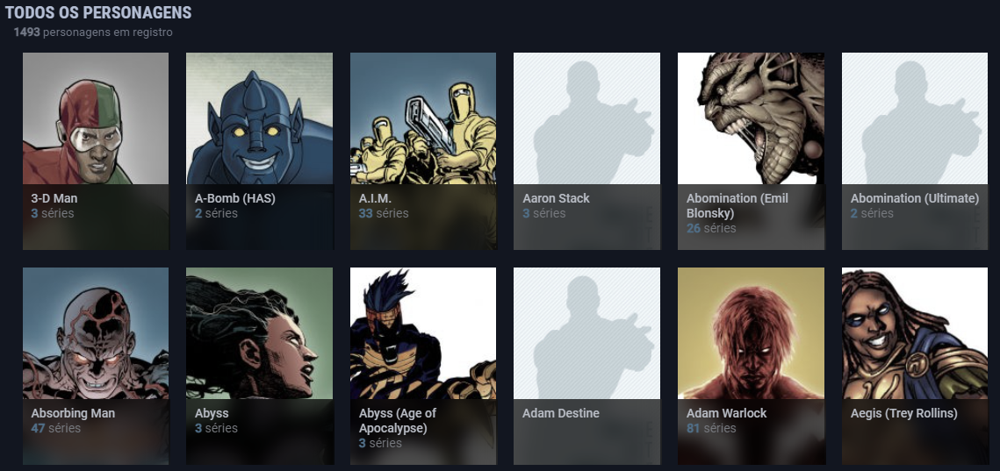

- O botão de próxima página é apresentado como um card no final da listagem

    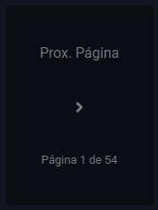

- Quando estiver em uma página que seja diferente da primeira você poderá encontrar um outro card no inicio da listagem que ao clicar permite voltar a tela inicial

    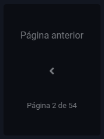

- ! Clicando no card de um personagem irá te direcionar para o perfil dele.

### <strong id="use-search">Pesquisa</strong>

- Após realizar uma pesquisa você será direcionado a tela de resultados, onde no topo poderá encontrar o termo que foi informado para a realização da consulta

    

- Logo abaixo temos o box de pesquisa, onde você poderá digitar outro termo e apertar enter para realizar uma nova consulta, o valor inicial será o termo que foi consultado.

    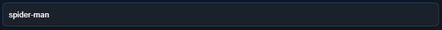

- Na listagem temos todos o resultado de todos os personagens encontrados para o termo informado

    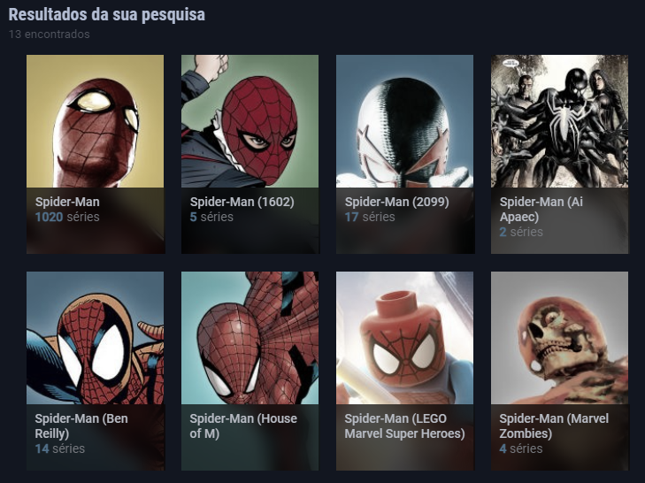

### <strong id="use-char">Perfil do personagem</strong>

- Na parte superior direita da tela temos o campo de pesquisa de personagem, caso deseje fazer a pesquisa diretamente pela tela da série

    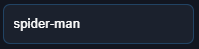

- Já no inicio temos as informações principais do personagem: Foto, titulo, oquantidade de séries que participou e a descrição abaixo caso tenha

    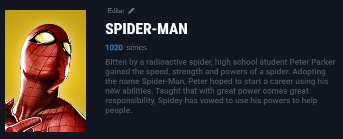

- Logo acima do nome você poderá encontrar um botão de "Editar", ao clicar será aberto o formulário para alteração dos dados (Nome e descrição) do personagem.

    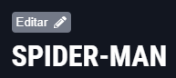

    Após finalizada as mudanças clique em <span style="color: #2dce89">ATUALIZAR</span>, caso deseje cancelar as modificações basta clicar em <span style="color: #f31431">CANCELAR</span>

    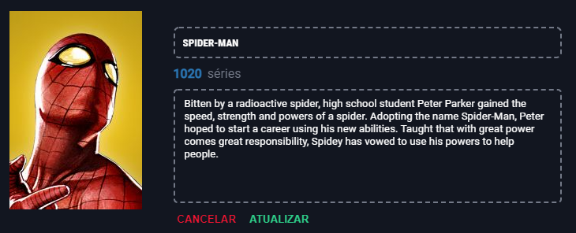

- Na parte inferior você encontrará todos as series nas quais o personagem teve participação, para mais informações da série basta clicar no card para abrir o perfil

    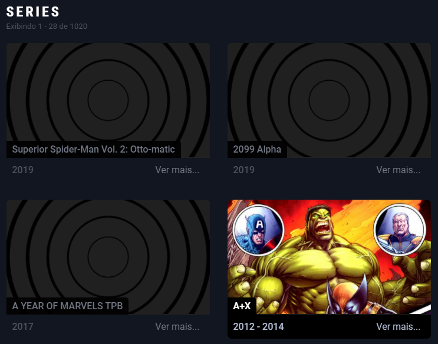

### <strong id="use-serie">Perfil da serie</strong>

- Na parte superior direita da tela temos o campo de pesquisa de personagem, caso deseje fazer a pesquisa diretamente pela tela do personagem

    

- Já no inicio temos as informações principais da série: Foto, titulo, o ano inicial/final e a descrição abaixo caso tenha

    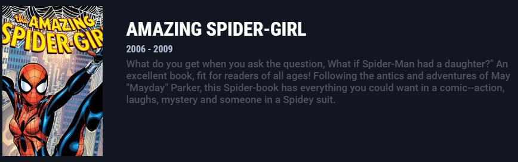

- Na parte inferior você encontrará todos os personagens que participaram dessa série, para mais informações do personagem basta clicar no card para abrir o perfil

    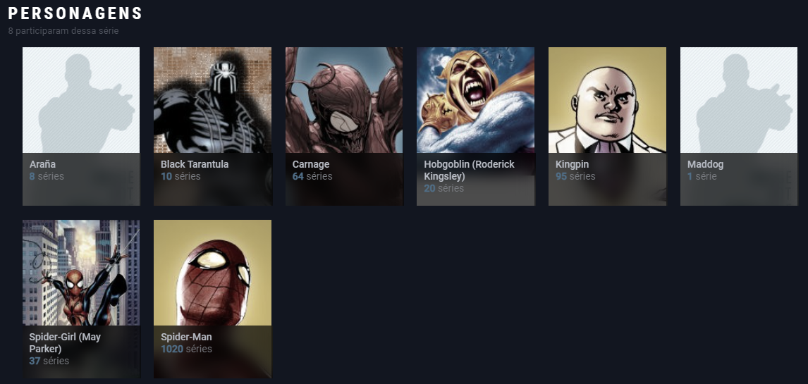


<!-- MARKDOWN LINKS -->
<!-- https://www.markdownguide.org/basic-syntax/#reference-style-links -->

[linkedin-shield]: https://img.shields.io/badge/-LinkedIn-black.svg?style=for-the-badge&logo=linkedin&colorB=555
[linkedin-url]: https://linkedin.com/in/judsonjuniorr
[product-screenshot]: docs/preview.png
[demo-url]: https://github.com/judsonjuniorr/marvelheroes
